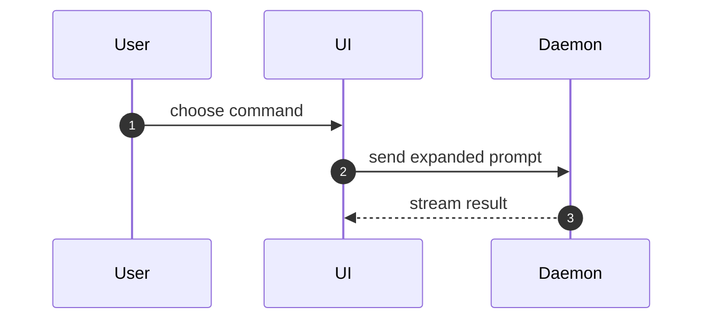

Help the user understand the current topic of conversation visually. Every invocation produces **one focused HTML report** and opens it. The report is the deliverable; the chat gets only a short answer plus a link to it.

## Every invocation

1. **Answer briefly in chat.** One or two plain-text sentences that state the key point, then the path/link to the report. The depth lives in the page — do not paste a wall of prose, diagrams, or long code into the chat.
2. **Build one HTML file and open it.** Write it to a temp location so you never dirty the working copy — the repo convention is a `/tmp` directory (see `inc:visual-plan`); a `mktemp -d` directory is fine. Keep the `show-me-{description}.html` naming. Tell the user where it is written.
3. **Open it** in the harness's own in-app/preview browser when it has one, otherwise the OS default browser:

```
Bash(open "$DIR/show-me-{description}.html")      # macOS
Bash(xdg-open "$DIR/show-me-{description}.html")  # Linux
Bash(start "$DIR/show-me-{description}.html")      # Windows
```

## Order the page intent-first — top to bottom

Every report is a ladder, and the rungs go in this order, always:

1. **Plain-language intent (top).** Open at a level a non-technical reader understands: what this is, what it does, and why it matters — in plain words. No jargon, no file paths, no type or function names. A reader must be able to stop after this first section and still walk away with a correct mental model.
2. **The reasoning (middle).** Why it works this way, the decision or the flow, the tradeoff. Now you may name concepts.
3. **The mechanics (bottom).** The concrete detail — calls, files, props, states, diffs, code. This is where the shapes below carry their weight.

This ordering is a rule, not a suggestion, and it governs every report. Never lead with the mechanics; the plain-language intent always comes first.

## Preferred shape: a numbered Mermaid diagram + matching numbered steps

Most topics have a flow, a sequence, or an interaction — so **reach for a Mermaid diagram with numbered steps by default**, paired with a numbered list beside or beneath it whose numbers match the diagram exactly. A `sequenceDiagram` with `autonumber` is the usual fit.

Write each list entry **intent-first**: the headline states the *intent or outcome* of that step in plain language — what it accomplishes and why — and the technical detail (the call, the file, the mechanism) is demoted to a description underneath. Never make the headline just a function or endpoint name.

Concrete worked example — the diagram and the list share one numbering:

```html
<pre class="mermaid">
sequenceDiagram
    autonumber
    participant You
    participant Skill as /inc:show-me
    participant Page as HTML report
    You->>Skill: ask to see how something works
    Skill->>Skill: pick the smallest set of shapes
    Skill->>Page: compose them into one file
    Skill-->>You: reply with a one-line answer + path
    Page-->>You: open, diagrams rendered
</pre>
<ol>
  <li><strong>You ask to understand something.</strong>
      The user invokes <code>/inc:show-me</code> on the current topic.</li>
  <li><strong>Keep only what answers the question.</strong>
      The skill selects the few shapes that make the point — no padding.</li>
  <li><strong>Everything lands in one page.</strong>
      The shapes are rendered into a single <code>show-me-*.html</code> file in a temp dir.</li>
  <li><strong>Chat stays short.</strong>
      The reply is one or two sentences plus the path; depth lives in the page.</li>
  <li><strong>You see diagrams, not source.</strong>
      The page opens with Mermaid already rendered.</li>
</ol>
```

## Shapes — the building blocks of the page

These are the vocabulary you compose *inside* the report, at the mechanics rung, next to the short text each one supports. Pick the smallest set that answers the current question; you will rarely use more than a few. Render each as real HTML — a `<pre>` for the text shapes, a rendered diagram for Mermaid.

**Escape angle brackets in text shapes.** Component trees and any diff of them contain literal `<` and `>` (e.g. `<SessionPage>`, `<RunSkillButton />`). Dropped verbatim into a `<pre>`, the browser parses those as tags and the shape silently vanishes — the same class of trap the Mermaid section solves below. Before placing any shape that contains `<`, `>`, or `&` inside a `<pre>`, HTML-escape it: `&lt;`, `&gt;`, `&amp;`.

- **Pseudocode** for logic or an algorithm:

```text
on(save)
  if content is unchanged
    return cached result
  write new content
  return fresh result
```

- **Call tree** for runtime control flow:

```text
submitForm
  createSession
    persistPrompt
    launchAgent
  navigateToSession
```

- **Component tree** for UI structure, including state and module boundaries that matter:

```tsx
<SessionPage> (apps/example/src/routes/session.tsx)
  useSessionEvents()
  <SessionToolbar>
    <RunSkillButton> (packages/ui)
```

- **File tree** (shallow) for file responsibility or a broad refactor:

```text
src/
├── commands/       # parses user actions
├── sessions/       # owns session state
└── transport/      # sends API requests
```

- **Mermaid** for component interaction, control flow, or data flow — prefer the numbered `sequenceDiagram` + matching numbered steps shown above:



- **`diff`** when the point is what changes and the surrounding shape already exists. Match the diff shape to the topic.

For a component change:

```diff
 <SessionPage>
   useSessionEvents()
   <SessionToolbar>
+    <RunSkillButton />
   <SessionTimeline>
+    <SkillResultCard />
```

For a file-layout change:

```diff
 src/
 ├── commands/
+│   └── show-me.ts       # expands the slash command
 ├── sessions/
-└── transport.ts
+└── transport/
+    ├── client.ts
+    └── stream.ts
```

For a call-tree or call-stack change:

```diff
 submitForm
   createSession
     persistPrompt
+    expandSkillMention
     launchAgent
-  navigateToSession
+  navigateToSession
+    subscribeToEvents
```

For a state or control-flow change:

```diff
 on(save)
-  write content
+  if content is unchanged
+    return cached result
+  write new content
+  invalidate cache
```

- **Whole code block** when most of it is new, when omitted context would hide ownership or order, or when the user needs a copyable target shape:

```ts
function expandSkill(command: string): string {
  const skillName = command.slice(1)
  return `use the ${skillName} skill`
}
```

## Rendering Mermaid in the file

A ```mermaid fence renders in a chat client but is **inert** in a raw HTML file — a reader would see the source text, not a diagram. Load the Mermaid script from a CDN with a pinned version and initialize it on load. Put diagram source inside `<pre class="mermaid">…</pre>` blocks and add, once, before `</body>`:

```html
<script type="module">
  import mermaid from "https://cdn.jsdelivr.net/npm/mermaid@11.4.1/dist/mermaid.esm.min.mjs";
  mermaid.initialize({ startOnLoad: true });
</script>
```

This is verified to render in a real browser. Keep the pin explicit so the page renders the same later.

## Design bar — applies to every report

- Match the product's colors, type, spacing, and components. Use real labels and data from the topic, not placeholders.
- Support desktop and mobile (fluid widths, readable at small sizes).
- Keep the text shapes in a monospace `<pre>` so their alignment survives; give diffs their add/remove coloring — wrap each diff line in a `<span>` colored by its leading `+` / `-` / space (green for adds, red for removes, muted for context).

## Restraint governs what goes in the page

Always-HTML does not mean always-maximal. A simple question gets a small, focused page — one diagram and a sentence — not a padded one. Keep only the calls, files, props, states, and boundaries needed to answer the user's current question or resolve the current discussion point. Use your judgement and don't overwhelm the user; the report earns its size from the question, never from this skill.
